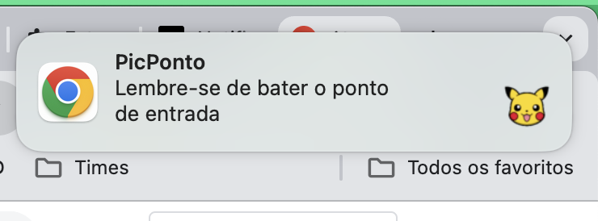
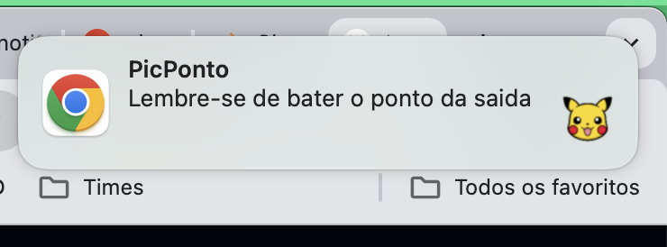
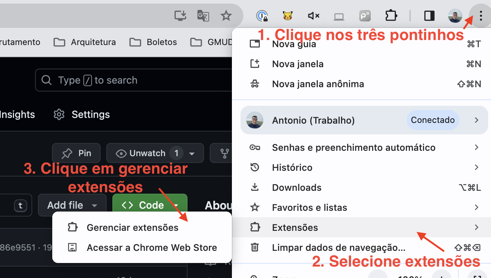
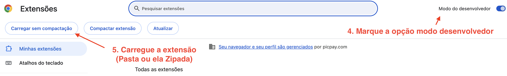
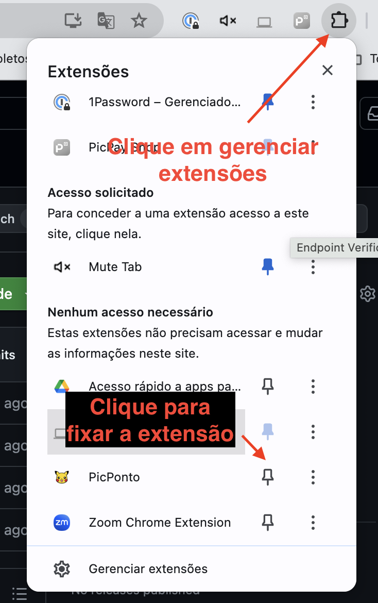

<h1> PicPonto </h1>

 ## Pré-requisitos

Antes de começar, certifique-se de que você tem o arquivo da extensão (geralmente um arquivo `.zip`) disponível no seu computador. Se necessário, extraia os arquivos da extensão de um arquivo `.zip` para uma pasta em seu computador. Os arquivos da extensão se encontram na pasta desse projeto chamado "chrome-extension". Certifique-se que essa pasta esteja zipada.

OBSERVAÇÃO: IMPORTANTE AS NOTIFICAÇÕES DO CHROME ESTAREM ATIVAS COMO NO EXEMPLO ABAIXO!

 
NOTIFICAÇÕES CHROME

  

## Passo a Passo

### COMO BAIXAR? Para fazer o download

### COMO INSTALAR? Passo a passo visual, clique no botão abaixo

 

  
PASSO A PASSO VISUAL

  
  
  

 

### Passo 1: Abrir a Página de Extensões

1. Abra o navegador Google Chrome.
2. Clique nos três pontos verticais no canto superior direito para abrir o menu.
3. Vá em "Mais ferramentas" > "Extensões". 
   1. Alternativamente, você pode digitar `chrome://extensions/` na barra de endereços e pressionar `Enter`.

### Passo 2: Ativar o Modo Desenvolvedor

Na página de extensões, localize o botão ou a chave para ativar o "Modo Desenvolvedor" no canto superior direito da página. Clique para ativar essa opção.

### Passo 3: Carregar a Extensão

Com o "Modo Desenvolvedor" ativado, você verá algumas opções adicionais. Clique no botão "Carregar sem compactação" ou "Carregar descompactada" (o texto exato pode variar). Se estiver zipado você pode usar a segunda opção. Se não estiver compactado, você pode carregar sem compactação, basta selecionar a pasta "chrome-extension".

### Passo 4: Selecionar a Pasta da Extensão

Uma janela do explorador de arquivos será aberta. Navegue até a pasta onde você extraiu os arquivos da extensão. Essa pasta deve conter o arquivo `manifest.json`. Selecione a pasta (não um arquivo individual dentro da pasta) e clique em "Selecionar pasta" ou "Abrir", dependendo do seu sistema operacional.

### Passo 5: Extensão Carregada

Após selecionar a pasta, a extensão será carregada no Chrome e aparecerá na lista de extensões. Você deve ver um ícone para a extensão junto aos outros ícones de extensões na barra de ferramentas do Chrome, ou poderá encontrá-lo clicando no ícone de quebra-cabeça (extensões) no canto superior direito.

### Passo 6: Usar a Extensão

Agora que a extensão está instalada, você pode começar a usá-la conforme necessário. Clique no ícone da extensão na barra de ferramentas para abrir qualquer interface de usuário ou popup que ela forneça, ou simplesmente navegue na web e deixe que a extensão funcione em segundo plano, dependendo de sua funcionalidade específica.

